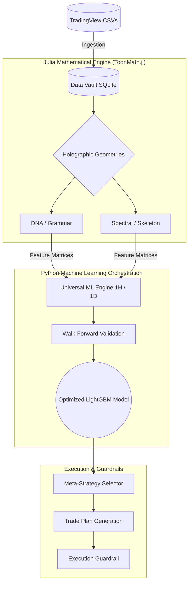

# Universal-ML

> **Institutional-Grade Quantitative ML Trading Engine**


Universal-ML is a high-performance, deterministic research and production trading system. It predicts market direction from `OHLCV` logs using purely holographic geometry and Smart Money Concepts (SMC) institutional-intent features.

---

## 🏛 Architecture

The system segregates heavy numerical compute to Julia (`ToonMath.jl`) and couples it with Python's robust Machine Learning and walk-forward orchestration layers. 



## ⚙️ Operating Lanes
Universal-ML actively computes and trains on the following lanes:
- `1H` Intraday Dynamics
- `1D` Daily Macro Positioning

## 🚀 Fast Start

> [!TIP]
> The repository is optimized with the `uv` package manager and provides `make` commands for accelerated operational efficiency.

### System Initialization
```bash
# Clone and enter directory
cd /home/km/Universal-ML

# Sync precise dependency trees via uv
make sync
```

### 1H Intraday Operations
```bash
# Train Canonical 1H Models
make train-1H

# Conduct Backtest Validations
uv run python backtest_engine.py --symbol NIFTY --outdir ./

# Fast Live Inference
make live-1H
```

### 1D Daily Operations
```bash
# Train Canonical 1D Models
make train-1D

# Conduct Backtest Validations
uv run python daily_backtest_engine.py --symbol NIFTY --outdir ./
```

## 🛡 Reliability & Regression Guardrails

> [!CAUTION]
> Accuracy-sensitive code modifications **must** be validated strictly with the guardrail pipeline to prevent mathematical drift or predictive regressions.

```bash
# 1. Capture base models before surgery
make validate-pre

# 2. Compare deviations post-surgery
make validate-post
```

## 📖 Institutional Knowledge Graph

If you are a new quantitative developer entering the stack, you must review the core architectural contracts in exact order:

1. [**PROJECT_MAP.md**](PROJECT_MAP.md) - The shortest accurate blueprint of system topology.
2. [**LAUNCH_INSTRUCTIONS.md**](LAUNCH_INSTRUCTIONS.md) - The operational production runbook.
3. [**AGENTS.md**](AGENTS.md) - Strict autonomous engineering laws and constraints.

## 🖧 Hardware Specifications

Performance boundaries are strictly aligned to the target cluster constraints:
- **Baseline Minimum Target:** Intel `i7-4770` Architecture
- **Memory Optimization Target:** `16 GB DDR3 RAM`
- **Cache Architecture:** M.2 NVMe Storage

---
*Proprietary algorithmic structure. All rights reserved.*
